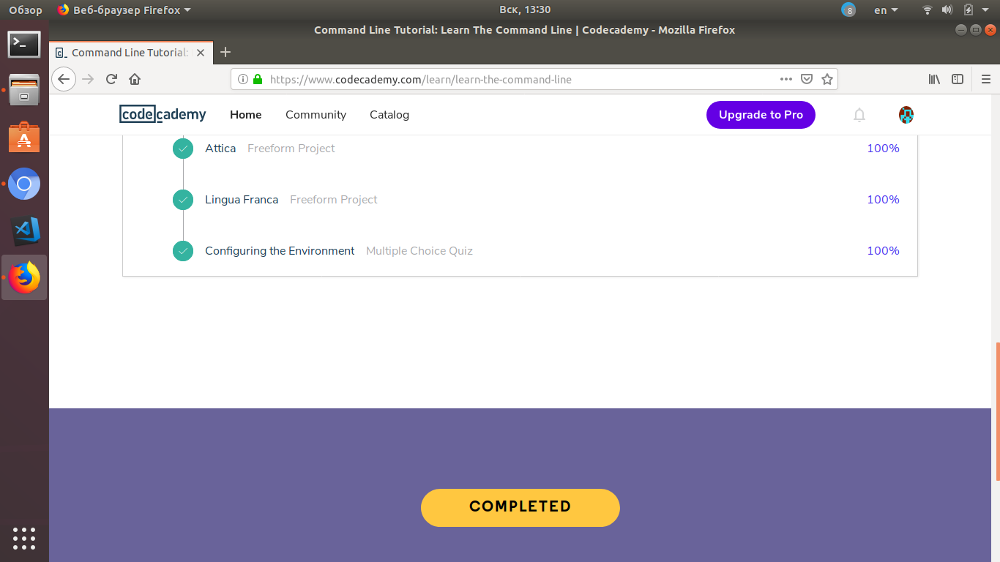
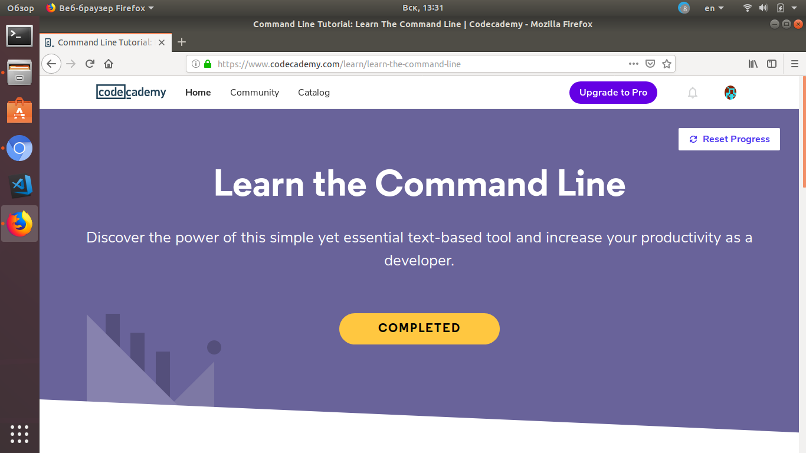
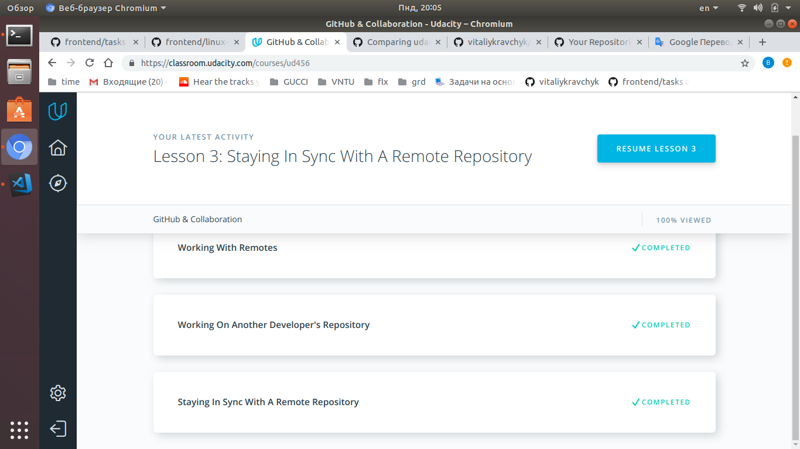
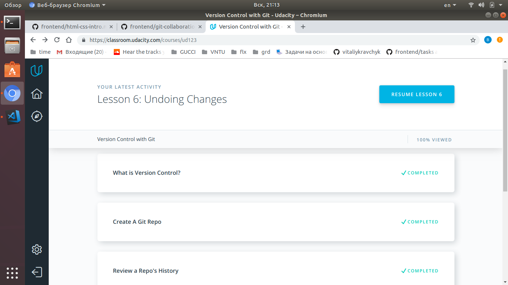
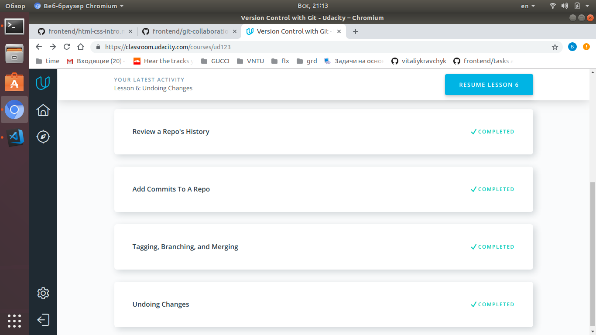
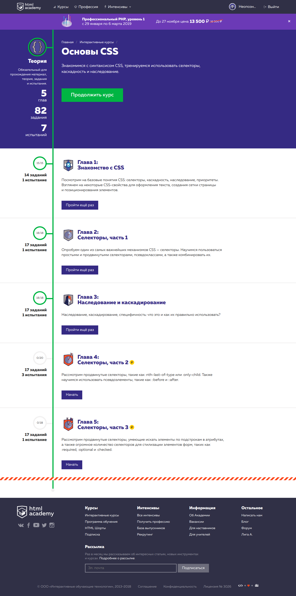
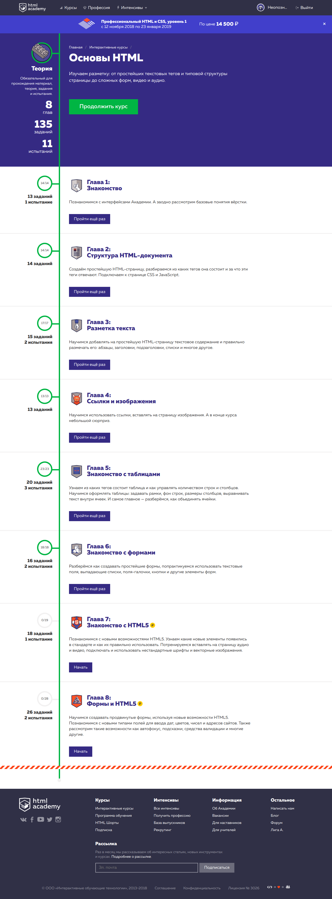
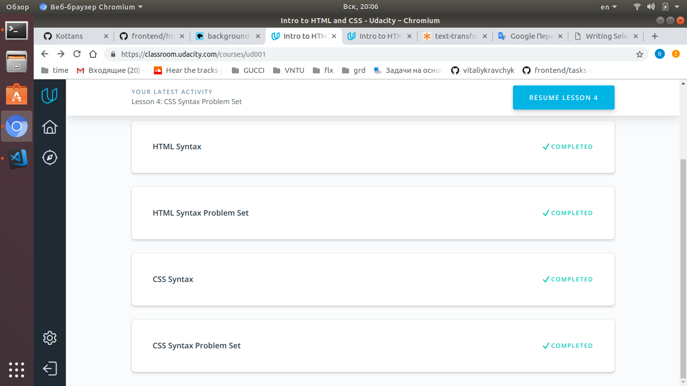

# kottans-frontend

## HI, THERE!

I'm glad to join kottans community!

Best wishes, Vitaliy  :)

## Task 2 --> Linux CLI, and HTTP
Now i'm done second task about Linux CLI and HTTP.
It was very useful for me i learned simple but powerful commands that help me to work with Command Line.
What about HTTP it's was interesting to learn how it work , about cache, transfering , methods and more else.
Quote which stayed in my head is: 

#### "HTTP is an application layer protocol over TCP, which is over IP."

## Task 3 --> Git Collaboration
I'm already done task third task it was about VSC and collaborations Git with Github.
Many new information what i learned was new for me but now i understand how to work with git , how to do commits, branches, merging of branches, pull and push it to Github. Interesting was about working with pullrequests and contributing.
I think this all new knowledges will help me to work with projects in future.

## Task 4 --> Intro to HTML and CSS
Finished task with fundamental steps in FE.
Many useful information about HTML structure, tags, forms, CSS selectors, inheriting etc.
Feels look like my skill in Front-End much better.

