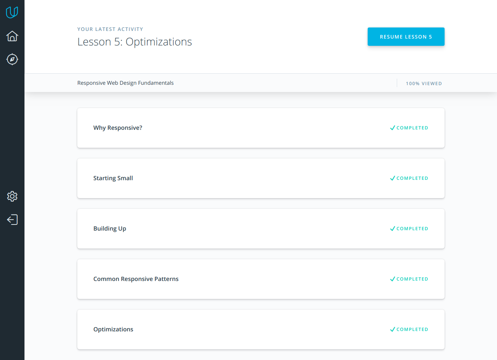
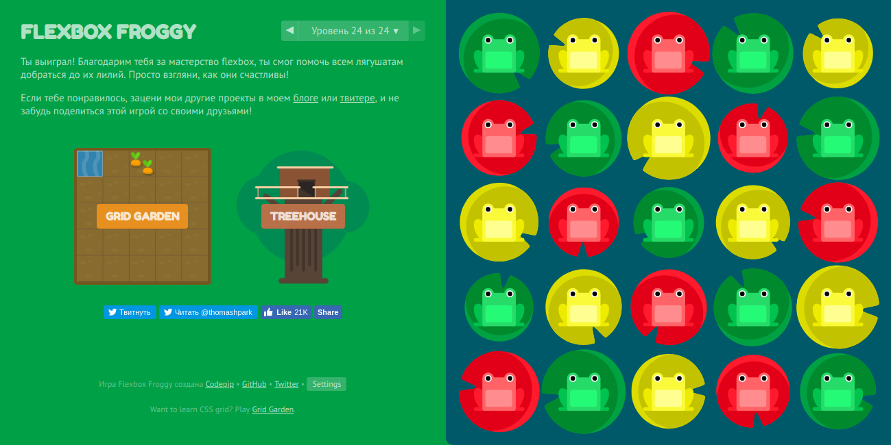
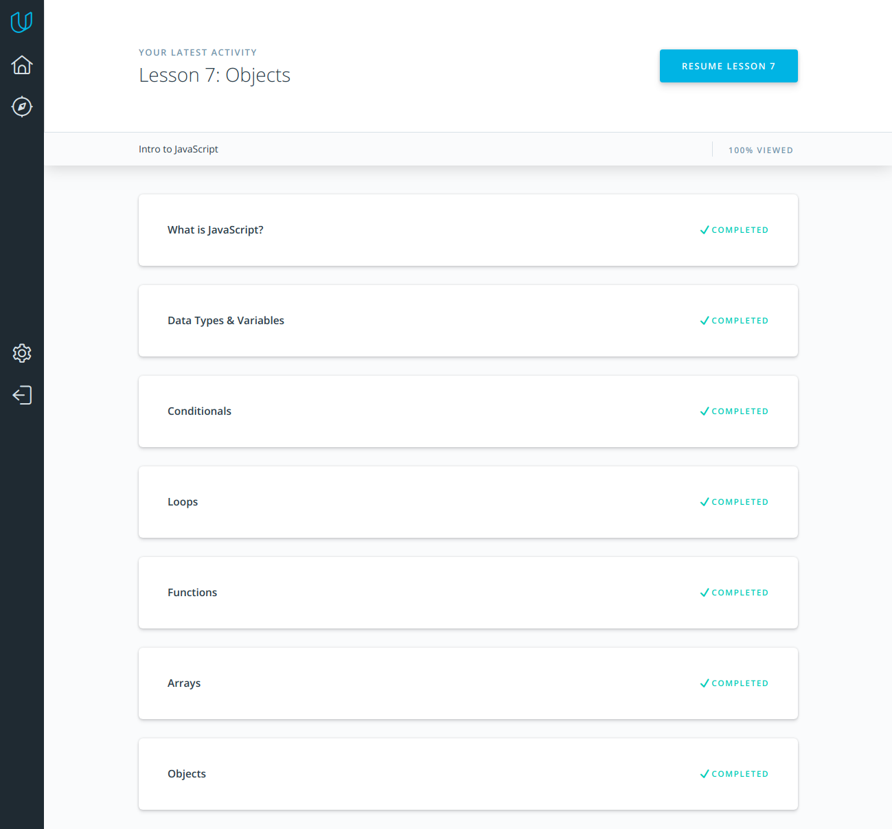
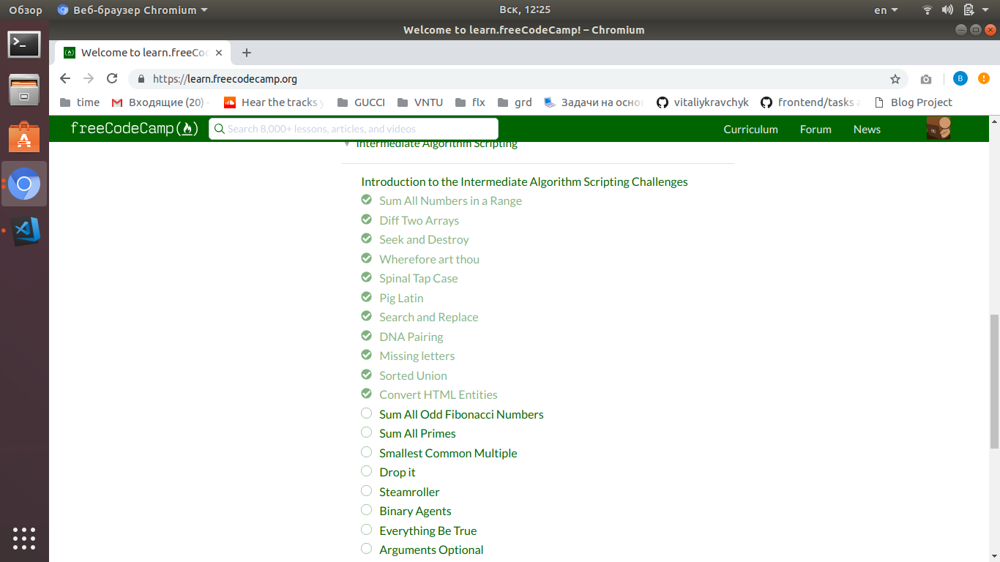
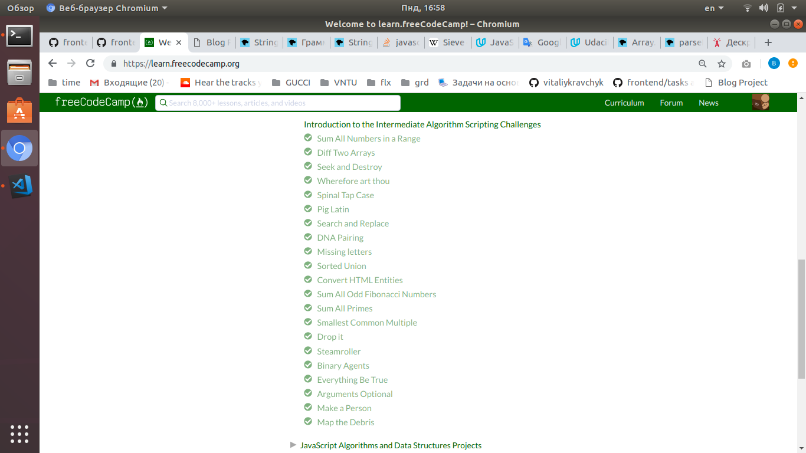
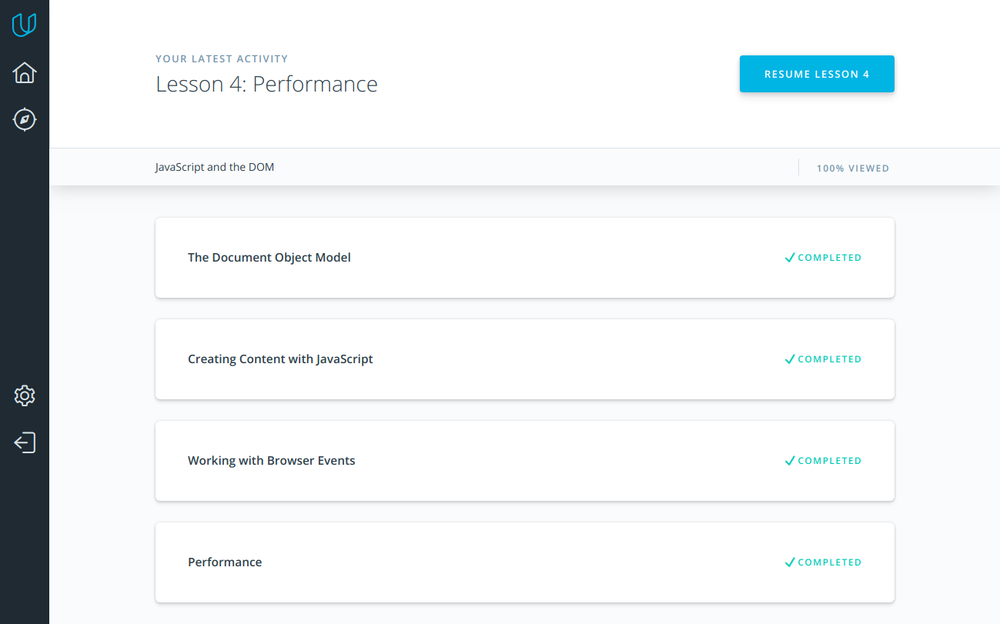
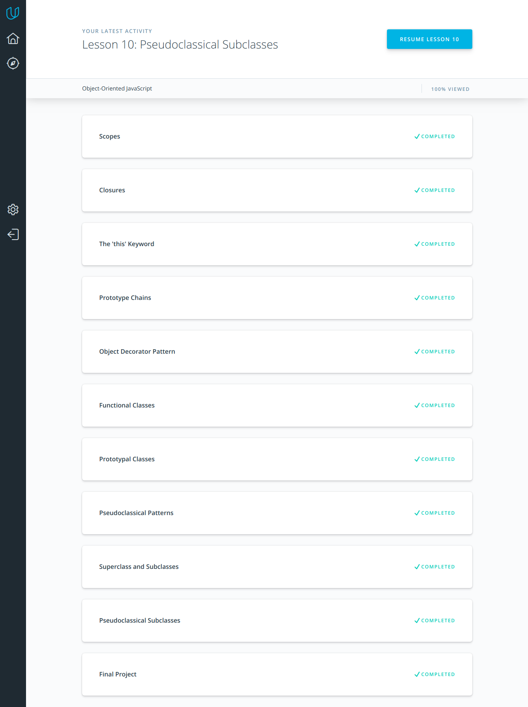

# kottans-frontend

## HI, THERE!

I'm glad to join kottans community!

Best wishes, Vitaliy  :)

## Task 1 --> Linux CLI, and HTTP
Now i'm done second task about Linux CLI and HTTP.
It was very useful for me i learned simple but powerful commands that help me to work with Command Line.
What about HTTP it's was interesting to learn how it work , about cache, transfering , methods and more else.
Quote which stayed in my head is: 

#### "HTTP is an application layer protocol over TCP, which is over IP."

## Task 2 --> Git Collaboration
I'm already done task third task it was about VSC and collaborations Git with Github.
Many new information what i learned was new for me but now i understand how to work with git , how to do commits, branches, merging of branches, pull and push it to Github. Interesting was about working with pullrequests and contributing.
I think this all new knowledges will help me to work with projects in future.

## Task 3 --> Intro to HTML and CSS
Finished task with fundamental steps in FE.
Many useful information about HTML structure, tags, forms, CSS selectors, inheriting etc.
Feels look like my skill in Front-End much better.

## Task 4 --> Responsive Web Design
I very satisfied for done this task, now i'm understand how to do website responsive. I'm learned new things like breakpoints, media queries , common  responsive paterns, also start using flexbox.

>### Responsive web design is an art, not a science.

## Task 5 --> JS Basics
In this task for me was RegExp. it's pretty cool to understand how to manipulate with Strings. Also freecodecamp tasks gives good practice in some algorithms.

# Task 6 --> DOM
At this task was much interesting and new information especially how to create, add, remove etc DOM elements , many methods for work with this one. This all gives new reflect about FE.

### [Demo](https://vitaliykravchyk.github.io/kottansDOM/) | [Codebase](https://github.com/vitaliykravchyk/kottans-frontend/tree/master/task_js_dom)
Reviewed and approved by @AMashoshyna
## Task 7 --> A Tiny JS World
It's good example that need to start thinking about something new that will do you code more simple.

### [Demo](https://vitaliykravchyk.github.io/a-tiny-JS-world/) | [Code base](https://github.com/vitaliykravchyk/a-tiny-JS-world/blob/gh-pages/index.js)
Reviewed and approved by @OleksiyRudenko
## Task 8 --> Object Oriented JS

This task was very interesting and i am learned methods how to do my code more simple and more powerful.

#### [Codewars profile](https://www.codewars.com/users/vitaliykravchyk)
### Frogger
#### [Demo](https://vitaliykravchyk.github.io/frogger/) | [Code base](https://github.com/vitaliykravchyk/frogger/tree/gh-pages)
Reviewed and approved by @AMashoshyna

## Task 9 --> OOP Exercise
In this task i'm upgraded previous same task code base with OOP that i learned at this course.

### [New code base](https://github.com/vitaliykravchyk/frontend-2019-homeworks/tree/a-tiny-js-world-2/submissions/vitaliykravchyk/a-tiny-js-world-2)
Reviewed and approved by @AMashoshyna